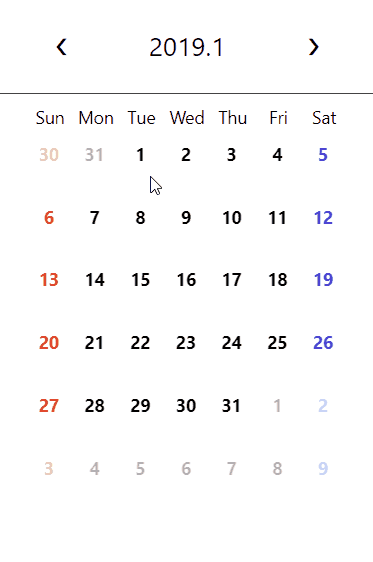
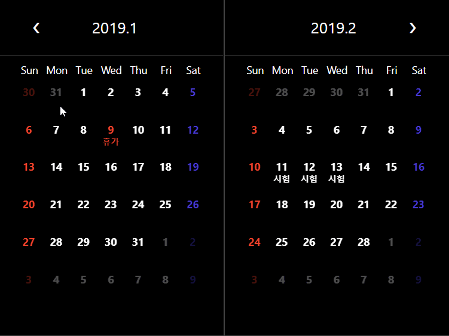

# react-calenpicker

<p>
  <a href="https://travis-ci.org/azxca1731/react-calenpicker">
    
  </a>
  <a href="https://www.npmjs.com/package/react-calenpicker">
    
  </a>
  <a href="https://react-calenpicker-storybook.netlify.com">
    
  </a>
</p>

<p>
    
  
</p>
리액트 캘린픽커는 리액트 캘린더 픽커의 줄임말로서 호텔, 항공권 같은 기간을 더 손쉽게 선택하기 위해 만들었습니다. 사용법은 간단합니다. 다음과 같이 입력해주세요

> npm install react-calenpicker
> <br />
> yarn add react-calenpicker

이렇게 설치하고 당신의 앱에 아래 예시와 비슷하게 입력 해주시면 됩니다.

```jsx
import React, { Component } from "react";
import Calendar from "react-calenpicker";

class App extends Component {
  render() {
    return (
      <div className="App">
        <Calendar />
      </div>
    );
  }
}

export default App;
```

이렇게 손쉽게 사용이 가능합니다.

---

### Demo

직접 Props를 넣어보면서 확인해보세요!

[](https://codesandbox.io/s/8x4yx51799)

---

### Storybook

캘린더 예시가 궁금하시나요? 혹은 리액트 캘린픽커의 컴포넌트에 대해 더 자세히 알고 싶으신가요?

[](https://react-calenpicker-storybook.netlify.com/)

---

### Props 소개

Props는 다음과 같습니다.

| Props              | Description                                                                                                                                                                                                                                 | Type                                                                    | Example                                                                                                                                                                    | Default  |
| ------------------ | ------------------------------------------------------------------------------------------------------------------------------------------------------------------------------------------------------------------------------------------- | ----------------------------------------------------------------------- | -------------------------------------------------------------------------------------------------------------------------------------------------------------------------- | -------- |
| `startDate`        | 달력이 처음 불러질때 언제 부터 보일지 선택할 수 있습니다.                                                                                                                                                                                   | String                                                                  | `<Calendar startDate="2018-12-29" />`                                                                                                                                      | False    |
| `callbackFunction` | 기간이 선택된 후 불려지는 함수입니다. 유저가 기간을 선택한 후에 보여질 것을 할 수 있습니다. callbackFunction으로 state를 조절하여 껏다 킬 수 있습니다.                                                                                      | Function                                                                | `<Calendar callbackFunction={period=>console.log(period)} />`                                                                                                              | ( )=>{ } |
| `indicateToday`    | 오늘을 표시합니다. 캘린더에 오늘이라고 표시가 됩니다.                                                                                                                                                                                       | Bool                                                                    | `<Calendar indicateToday />`                                                                                                                                               | False    |
| `multiSelect`      | 다중 선택이 가능하게 됩니다. 다중선택을 할 시에 callbackFunction이 선택할 때 마다 선택됩니다.                                                                                                                                               | Bool                                                                    | `<Calendar multiSelect />`                                                                                                                                                 | False    | \  |
| `duplicate`        | 두 개의 캘린더가 연속적으로 나와 더 크게 볼 수 있습니다.                                                                                                                                                                                    | Bool                                                                    | `<Calendar duplicate />`                                                                                                                                                   | False    |
| `onlyThisMonth`    | 이번 달만 보여줄 수 있습니다. 전달이나 앞달이 보이지 않게 됩니다.                                                                                                                                                                           | Bool                                                                    | `<Calendar onlyThisMonth />`                                                                                                                                               | False    |
| `sizeOption`       | 사이즈를 선택 할 수 있습니다.                                                                                                                                                                                                               | `sm`, `md`, `lg` 혹은 {width: string, height: string }                  | `<Calendar sizeOption="lg" />` or `<Calendar sizeOption= { width: "300px" height: "400px" } />`                                                                            | `md`     |
| `theme`            | 테마를 선택 할 수 있습니다                                                                                                                                                                                                                  | `light`,`dark`                                                          | `<Calendar theme="dark" />`                                                                                                                                                | `light`  |
| `addText`          | 달력에서 바로 이벤트를 추가 할 수 있습니다.                                                                                                                                                                                                 | Bool                                                                    | `<Calendar addText />`                                                                                                                                                     | False    |
| `canMouseWheel`    | 마우스 휠로 달을 바꿀 수 있습니다                                                                                                                                                                                                           | Bool                                                                    | `<Calendar canMouseWheel />`                                                                                                                                               | False    |
| `customTheme`      | 커스텀 테마를 적용 가능합니다.                                                                                                                                                                                                              | Object                                                                  | `<Calendar customTheme={{ backgroundColor: "#efefef", secondaryColor: "#fe88a0", fontColor: "#74c9c6" }} />`                                                               | Null     |
| `canUpdateDate`    | 날짜에 글씨(일정)이 있는 날을 수정,삭제 할 수 있습니다.                                                                                                                                                                                     | Bool                                                                    | `<Calendar canUpdateDate />`                                                                                                                                               | False    |
| `scheduleListener` | 스케줄이 수정, 추가, 삭제가 될 때 마다 이 함수를 호출 합니다.                                                                                                                                                                               | Function                                                                | `<Calendar scheduleListener={schedules=>console.log(schedules)} />`                                                                                                        | () => {} |
| `schedules`        | 텍스트 커스터마이징을 할 수 있습니다. 원하는 날짜를 date에 넣고 text에 원하는 말을 적으면 됩니다. isHoliday값의 true면 빨간색이 됩니다. 추가로, scheduleID에 원하는 내용을 입력하면, 해당 내용을 포함하고 있는 다른 스케줄이 그룹화 됩니다. | arrayOf({text: string,date: string,isHoliday: bool,scheduleID: string}) | `<Calendar schedules={[ { text: "연말", date: "2018-12-31", schduleID: "endOfYear" }, { text: "휴가", date: "2018-12-26", isHoliday: true, scheduleID: "vacation" } ]} />` | [ ]      |
| `indicateScheduleByStick` | 일정을 텍스트로 표현할 것인지, 막대로 표시할 것인지를 설정합니다. | False | `<Calendar schdules={[{...}]} indicateScheduleByStick />` | Bool |

Deprecated
더 이상 사용할 수 없는 옵션은 다음과 같습니다.

| Props           | Description                                                                                              |
| --------------- | -------------------------------------------------------------------------------------------------------- |
| `objectSetText` | 일정, 커스텀 텍스트에 해당하는 내용이었으나 이제부터 일정으로써 따로 관리하게 되었으므로 삭제하였습니다. |

---

scheduleListener

### CSS Cutomizing Props

다음 부터 나오는 props는 원하는 css를 커스터마이징 하기위해 있는 props입니다. 원하시는 Css Object를 넣으시면 됩니다.

어느 것을 바꾸고 싶은지 보실려면 [스토리북](https://react-calenpicker-storybook.netlify.com/)을 참조해주세요!

| Props                 | Description                        | Type   |
| --------------------- | ---------------------------------- | ------ |
| DateCssObject         | Date 컴포넌트의 css Object         | object |
| WeekCssObject         | Week 컴포넌트의 css Object         | object |
| TemplateCssObject     | Template 컴포넌트의 css Object     | object |
| MonthCssObject        | Month 컴포넌트의 css Object        | object |
| MonthArrowCssObject   | MonthArrow 컴포넌트의 css Object   | object |
| WeekDayCssObject      | WeekDay 컴포넌트의 css Object      | object |
| CalendarBodyCssObject | CalendarBody 컴포넌트의 css Object | object |
| CalendarHeadCssObject | CalendarHead 컴포넌트의 css Object | object |

예시 `<Calendar MonthCssObject={{ color: "white" }} />`

---

### Contributing

우리는 언제든지 기여를 환영합니다!
[이 문서](https://github.com/azxca1731/react-calenpicker/blob/master/CONTRIBUTING.md)를 읽어주세요.<br />

따로 슬랙 커뮤니티를 이용중입니다. 원하시면 azxca1731@gmail.com으로 이메일 주세요! 초대해드리겠습니다!

---

### Contributors

[김동현](https://github.com/DongDongKim)<br />

[공정훈](https://github.com/rhdtl78)<br />

[이정훈](https://github.com/azxca1731)<br />

---

### Thanks

이 프로젝트는 Dinesh Pandiyan의 [보일러플레이트](https://github.com/flexdinesh/react-npm-package-boilerplate)를 기반으로 만들었습니다.
